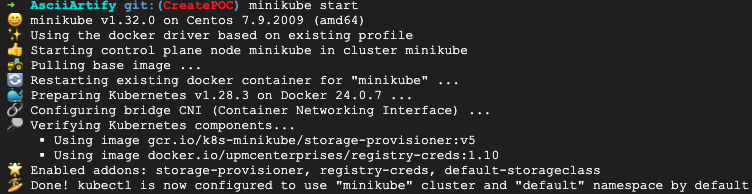
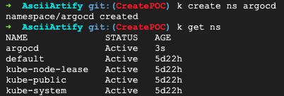
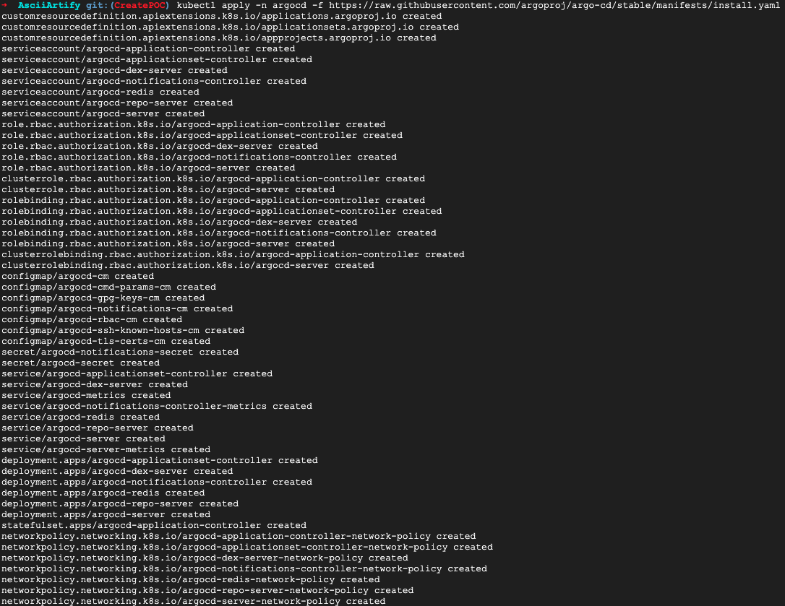
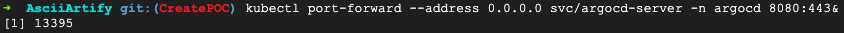
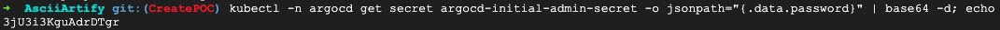
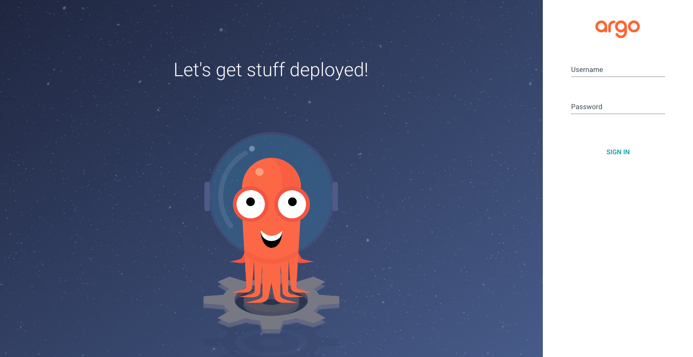
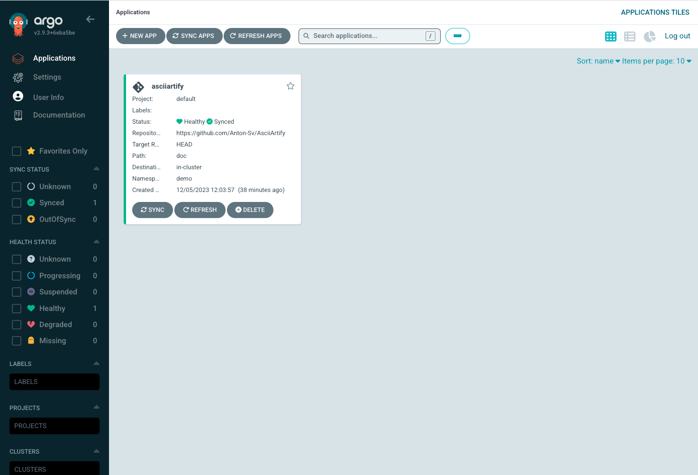

#AsciiArtify project
##List of actions to activate ArgoCD
1. Start minikube cluster with **minikube start**. All next actions will be with **kubectl**.

2. Create namespace ***argocd*** with **kubectl create ns argocd**.

3. Apply argocd install (inside argocd namespace) from argocd official manifest with **kubectl apply -n argocd -f https://raw.githubusercontent.com/argoproj/argo-cd/stable/manifests/install.yaml**.

4. Create port forwarding for external access to the argocd ui **kubectl port-forward --address 0.0.0.0 svc/argocd-server -n argocd 8080:443&**.

5. Generate password for argocd ui access(login admin) **kubectl -n argocd get secret argocd-initial-admin-secret -o jsonpath="{.data.password}" | base64 -d; echo**.

6. Enter **https://127.0.0.1:8080** (or use external IP if remote) and use created password.

7. If credentials are OK you will see the Dashboard.

##Demonstration

